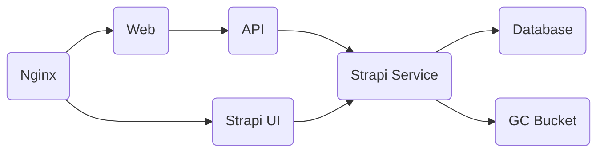

# Instructions for GitHub Copilot

## Project Context

The repository contains two main services:

### 1. API
- **Framework**: Fastify.
- **Purpose**: Provide endpoints to interact with the CMS (Strapi) and other services like Brevo.
- **Configuration**: Route configuration is found in `api/app/config/routes.ts`.
- **Structure**:
  - `v1/`: Contains modules like `brevo`, `strapi`, `utils`, and `constants`.
  - `app.ts`: Main entry point for the Fastify server.
- **Linting**: Configured with ESLint (`api/eslint.config.js`) with strict rules such as:
  - Mandatory use of `semi` and single quotes.
  - Prohibition of `console.log` in production.
  - 4-space indentation.

### 2. Web
- **Framework**: React with TypeScript.
- **Bundler**: Vite.
- **Purpose**: User interface for the pianists' portfolio.
- **Configuration**: Vite configuration in `web/vite.config.ts`.
- **Structure**:
  - `components/`: Contains reusable components like `Navbar`, `Footer`, and `Menu`.
  - `pages/`: Contains main pages like `Repertoire`.
  - `utils/`: Helper functions.
- **Linting**: Configured with ESLint (`web/eslint.config.js`) with rules similar to those of the API.

## Architecture

The project's architecture is composed of the following elements:

- **Nginx**: Reverse proxy for additional security.
- **Web**: Piano Duo Frontend.
- **API**: Fastify API service.
- **Strapi UI**: UI for Strapi Service.
- **Strapi Service**: Strapi Service with connection to Database and Bucket.
- **PostgreSQL**: Database for Strapi.
- **Google Cloud**: File storage and deployment.

## Development Workflow

1. **Branching**:
   - Create a branch with the name format: `PD-{ClickUp task ID}`
   - Each commit must include the branch name

2. **Pull Requests**:
   - Title must include the branch name and a brief description of what is being added
   - Description must detail the objective, modifications, and tests for that task
   - PRs must always target the `develop` branch

## Cloud Infrastructure

All infrastructure is deployed in Docker containers using Cloud Run on GCP. Deployment is managed through Cloud Builds that are directly integrated with GitHub and deploy the main branch, with one pipeline for each service (web, strapi, and api). 

A GCP bucket is used to store all media uploaded to Strapi through a custom integration. A PostgreSQL database runs on a Google Cloud VM to serve Strapi.

## Services Structure

The API has been modified to have a service-based structure. Currently, there are two services:
- **Strapi**: For content management
- **Brevo**: For handling email communications

## Project Standards

1. **Commits**:
   - Before each commit, automatic scripts are executed to verify code quality and message format.
   - Message format: `"PD-{ClickUp Task Code} ...rest of commit message"`.

2. **Linting**:
   - Automatically runs before commits.
   - Strict rules to maintain code quality.

3. **Deployment**:
   - Deployment configuration in Google Cloud through YAML files in `tools/`.
   - Environment variables managed through `.env` files.

## Policies

- **Code Quality**: Mandatory use of ESLint with strict rules.
- **Code Review**: All PRs must be reviewed before being merged.
- **Security**: Use of Nginx as a reverse proxy and security policies in Strapi (`middlewares.ts`).