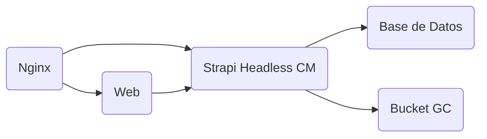

# Instrucciones para GitHub Copilot

## Contexto del Proyecto

El repositorio contiene dos servicios principales:

### 1. API
- **Framework**: Fastify.
- **Propósito**: Proveer endpoints para interactuar con el CMS (Strapi) y otros servicios como Brevo.
- **Configuración**: La configuración de rutas se encuentra en `api/app/config/routes.ts`.
- **Estructura**:
  - `v1/`: Contiene módulos como `brevo`, `strapi`, `utils`, y `constants`.
  - `app.ts`: Punto de entrada principal del servidor Fastify.
- **Linting**: Configurado con ESLint (`api/eslint.config.js`) con reglas estrictas como:
  - Uso obligatorio de `semi` y comillas simples.
  - Prohibición de `console.log` en producción.
  - Indentación de 4 espacios.

### 2. Web
- **Framework**: React con TypeScript.
- **Bundler**: Vite.
- **Propósito**: Interfaz de usuario para el portafolio de pianistas.
- **Configuración**: Configuración de Vite en `web/vite.config.ts`.
- **Estructura**:
  - `components/`: Contiene componentes reutilizables como `Navbar`, `Footer`, y `Menu`.
  - `pages/`: Contiene las páginas principales como `Repertoire`.
  - `utils/`: Funciones auxiliares.
- **Linting**: Configurado con ESLint (`web/eslint.config.js`) con reglas similares a las del API.

## Arquitectura

La arquitectura del proyecto está compuesta por los siguientes elementos:

- **Nginx**: Reverse proxy para seguridad adicional.
- **Strapi**: CMS para gestionar contenido.
- **PostgreSQL**: Base de datos para Strapi.
- **Google Cloud**: Almacenamiento de archivos y despliegue.

## Normas del Proyecto

1. **Commits**:
   - Antes de cada commit, se ejecutan scripts automáticos para verificar la calidad del código y el formato del mensaje.
   - Formato del mensaje: `"PD-{Código Tarea ClickUp} ...resto del mensaje commit"`.

2. **Linting**:
   - Se ejecuta automáticamente antes de los commits.
   - Reglas estrictas para mantener la calidad del código.

3. **Despliegue**:
   - Configuración de despliegue en Google Cloud mediante archivos YAML en `tools/`.
   - Variables de entorno gestionadas a través de archivos `.env`.

## Políticas

- **Calidad del Código**: Uso obligatorio de ESLint con reglas estrictas.
- **Revisión de Código**: Todos los PR deben ser revisados antes de ser fusionados.
- **Seguridad**: Uso de Nginx como reverse proxy y políticas de seguridad en Strapi (`middlewares.ts`).