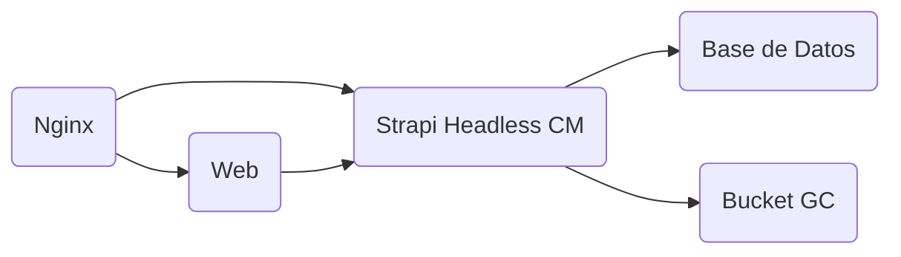

# Proyecto Piano Duo

Portfolio personal de pareja de pianistas profesionales. Este es un proyecto **Fullstack** con el stack:
- **React** con **Typescript** para la parte Frontend.
> Se está usando **Vite** como Bundler
- Un servicio de **Strapi** como Headless CMS.
- **PostgreSQL** para los datos de Strapi.

## Arquitectura
La arquitectura está compuesta por 4 elementos principales como se ve en el siguiente gráfico:

Todo desplegado en una **VM** de Google Cloud, detrás de un **reverse-proxy** de **Nginx** para extra seguridad. 

## Entorno de Desarrollo
Para levantar el proyecto en desarrollo se requiren de los siguientes pasos:
1. Clonarse el repositorio en local Clonarse el repositorio en local: `git clone https://github.com/Adotel15/piano-duo.git`
2. Desde la **raíz** del proyecto ejecutar `npm run configure-dev-environment`
3. Crear archivo `.env` dentro del directorio de strapi, y copiar el contenido de (https://app.clickup.com/9012195968/v/dc/8cjpcm0-152/8cjpcm0-792) en la sección de **Strapi** dentro.
4. Crear archivo `.env` dentro del directorio de web y copiar el contenido de (https://app.clickup.com/9012195968/v/dc/8cjpcm0-152/8cjpcm0-792) en la sección de **Frontend** dentro.
5. Para levantar los servicios se puede hacer por separado tanto para la web como para la terminal en dos terminales diferentes. O con el comando `npm run dev` ejecutado desde la raíz.

## Normas
Antes de ejecutar un **commit** se ejecutará de manera automática un script para comprobar la calidad del código que se está intenando commitear para asegurarse que cumple las reglas establecidas en el proyecto, así como un script para comprobar que el mensaje del commit tiene el formato correcto que debe ser `"PD-{Código Tarea ClickUp} ...resto del mensaje commit"`.