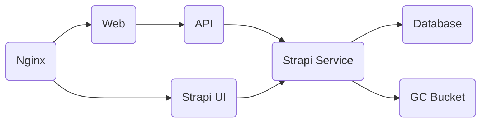

# Piano Duo Project

Personal portfolio for a professional pianist duo. This is a **Fullstack** project with the following stack:
- **React** with **TypeScript** for the Frontend.
  > Using **Vite** as the Bundler
- **Fastify** API service to interact with Strapi and other services like Brevo.
- A **Strapi** service as a Headless CMS.
- **PostgreSQL** for Strapi data.

## Architecture
The project's architecture is composed of the following elements:

- **Nginx**: Reverse proxy for additional security.
- **Web**: Piano Duo Frontend.
- **API**: Fastify API service.
- **Strapi UI**: UI for Strapi Service.
- **Strapi Service**: Strapi Service with connection to Database and Bucket.
- **PostgreSQL**: Database for Strapi.
- **Google Cloud**: File storage and deployment.

All services are deployed in Docker containers using Google Cloud Run, with a **Nginx** reverse-proxy for additional security. 

## Cloud Infrastructure

- **Containers**: All services are containerized with Docker
- **Deployment**: Uses Cloud Run on GCP, managed through Cloud Builds
- **CI/CD**: Cloud Builds are integrated with GitHub, with separate build pipelines for each service (web, strapi, api)
- **Storage**: A GCP bucket stores all media uploaded to Strapi
- **Database**: PostgreSQL runs on a Google Cloud VM

## Development Environment
To set up the project for development, follow these steps:
1. Clone the repository: `git clone https://github.com/Adotel15/piano-duo.git`
2. From the **root** of the project, run `npm run configure-dev-environment`
3. Create a `.env` file in the strapi directory, and copy the content from the **Strapi** section at (https://app.clickup.com/9012195968/v/dc/8cjpcm0-152/8cjpcm0-792)
4. Create a `.env` file in the web directory and copy the content from the **Frontend** section at (https://app.clickup.com/9012195968/v/dc/8cjpcm0-152/8cjpcm0-792)
5. Create a `.env` file in the api directory and copy the content from the **API** section at (https://app.clickup.com/9012195968/v/dc/8cjpcm0-152/8cjpcm0-792)
6. To start the services, you can either run them separately using different terminals, or use the command `npm run dev` from the root.

## Project Standards

### Code Quality
Before executing a **commit**, automatic scripts will run to check the quality of the code against the established project rules, and to ensure that the commit message follows the correct format: `"PD-{ClickUp Task Code} ...rest of commit message"`.

### Development Workflow
1. **Branching**:
   - Create a branch with the format: `PD-{ClickUp task ID}`
   - Each commit must include the branch name

2. **Pull Requests**:
   - Title must include the branch name and a brief description of what is being added
   - Description must detail the objective, modifications, and tests for that task
   - PRs must always target the `develop` branch

### Services Structure
The API has been structured into services:
- **Strapi**: For content management
- **Brevo**: For handling email communications