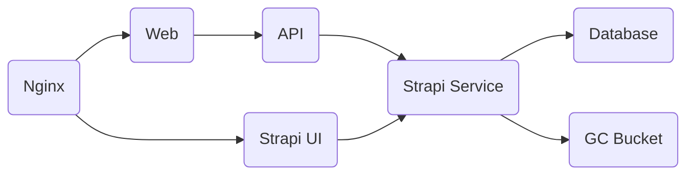

# Piano Duo Project

Personal portfolio for a professional pianist duo. This is a **Fullstack** monorepo with the following stack:

- **React** with **TypeScript** for the Frontend (using **Vite** as bundler)
- **Fastify** API service to interact with Strapi and other services like Brevo
- **Strapi** as a Headless CMS
- **PostgreSQL** on **Neon** (serverless) for Strapi data
- **Google Cloud Storage** bucket for multimedia content

## Repository Structure

```
piano-duo/
├── api/                    # Fastify API service (port 8081)
├── web/                    # React + Vite frontend (port 8080)
├── strapi/                 # Strapi CMS (port 8082)
├── scripts/                # Dev scripts (install, start, lint, etc.)
├── .github/                # GitHub workflows & copilot config
├── .husky/                 # Git hooks (commit message validation)
├── docker-compose.yaml
├── package.json
└── .nvmrc                  # Node 20.10.0
```

## Architecture


```mermaid
graph LR
E(Nginx) --> G
E --> D
B(Strapi Service) --> A(Database)
B --> C(GC Bucket)
D(Web) --> F
F(API) --> B
G(Strapi UI) --> B
```

- **Web**: React/TypeScript frontend served by Nginx in production.
- **API**: Fastify service that acts as middleware between the frontend and Strapi/Brevo.
- **Strapi UI**: Admin panel for content management.
- **Strapi Service**: Headless CMS connected to Database and GCP Bucket.
- **Database**: PostgreSQL on Neon (serverless).
- **GC Bucket**: Google Cloud Storage for all media uploads (images, audio, etc.).

## Cloud Infrastructure

### Cloud Run

Three services deployed on Google Cloud Run in `europe-west1`:

| Service | Cloud Run name | Port |
|---------|---------------|------|
| Web | `piano-duo-web` | 8080 |
| API | `piano-duo-api` | 8081 |
| Strapi | `piano-duo-strapi` | 8082 |

Each service has its own `Dockerfile` and `cloudbuild.yaml` inside its directory.

### Database

PostgreSQL hosted on **Neon** (serverless Postgres). The connection uses Neon's connection pooler with SSL enabled, hosted in `eu-central-1`.

### Storage

A GCP bucket (`piano-duo-media`) stores all multimedia content uploaded through Strapi (images, audio files, etc.). Strapi uses the `@strapi-community/strapi-provider-upload-google-cloud-storage` plugin.

### CI/CD

**Cloud Build** is configured to automatically deploy on push to `main`:

1. Detects changes in the repository
2. Runs the `cloudbuild.yaml` of each service
3. Builds the Docker image and pushes it to **Artifact Registry** (`europe-west1-docker.pkg.dev`)
4. Deploys the new image to the corresponding **Cloud Run** service

## Development Setup

### Prerequisites

- **Node.js 20.10.0** (use [nvm](https://github.com/nvm-sh/nvm))
- **Docker** & **Docker Compose** (only if running with containers)

### Install Dependencies

```bash
# Clone the repository
git clone https://github.com/Adotel15/piano-duo.git
cd piano-duo

# Use the correct Node version
nvm use

# Install all service dependencies at once
npm run configure-dev-environment

# Or install individually per service
npm run install-web-dependencies
npm run install-strapi-dependencies
npm run install-api-dependencies
```

### Environment Variables

Create a `.env` file in each service directory (`web/`, `api/`, `strapi/`). The credentials and values are stored in **ClickUp**:

> https://app.clickup.com/9012195968/v/dc/8cjpcm0-152/8cjpcm0-792

Each section (Frontend, API, Strapi) contains the corresponding `.env` content.

### Start Development Servers

```bash
# Start each service individually (each in its own terminal)
npm run start-dev-web
npm run start-dev-strapi
npm run start-dev-api
```

## Docker Compose

To run the full stack locally with Docker:

```bash
# Build and start all services
docker compose up --build

# Or run in background
docker compose up -d --build

# Stop all services
docker compose down
```

> **Note:** The `api/.env` and `strapi/.env` files must exist before running docker compose, as the containers load them via `env_file`.

Services will be available at:
- **Web**: http://localhost:8080
- **API**: http://localhost:8081
- **Strapi**: http://localhost:8082

## Project Standards

### Code Quality

Before executing a **commit**, automatic scripts will run to check the quality of the code against the established project rules, and to ensure that the commit message follows the correct format: `"PD-{ClickUp Task Code} ...rest of commit message"`.

### Development Workflow

1. **Branching**:
   - Create a branch with the format: `PD-{ClickUp task ID}`
   - Each commit must include the branch name

2. **Pull Requests**:
   - Title must include the branch name and a brief description of what is being added
   - Description must detail the objective, modifications, and tests for that task
   - PRs must always target the `develop` branch

### API Services

The API is structured into two integration modules:
- **Strapi**: For content management (proxying CMS data to the frontend)
- **Brevo**: For handling email communications
